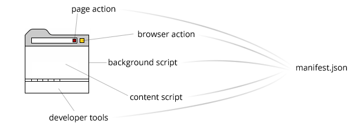

# Chrome Extensions

## Architecture:

## Extension UIs
Each extension can have atmost one browser action or page action
- Browser actions: Choose when extension is relevant to most pages
- Page actions: Choose when extension is active/inactive depending on the page

## Manifest file
Main settings file

## Background Page
- defined by *background.html*, invisible page, holds the main logic of extension
- There are two types of them:
  * Persistent:
  * Event:

## Content Script
- Script required to interact with the user loaded pages 
